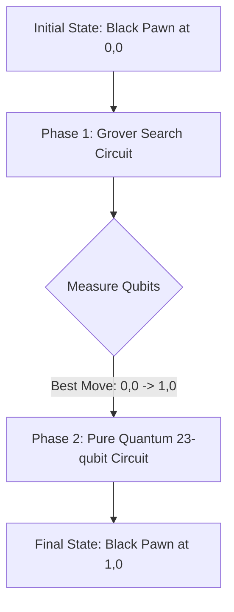

# 2×2 Grover + Pure Quantum Demonstration: Complete Pipeline Explanation

**Quantum Chess Engine — Hybrid Architecture Deep Dive for Faculty Review**

> **Scenario**: A 2×2 chess board with a single Black Pawn at position (0,0) and no other pieces.  
> **Goal**: The system must autonomously find the optimal path (move) using Grover's Algorithm, and then physically execute that move using the Pure Quantum deterministic circuit.
> **Menu Option**: Option 7 in `main.py` ("Run 2x2 Grover Search (Autonomous Demo)")

---

## 1. The Autonomous Pipeline

Unlike the interactive modes where a human inputs a move, this demonstration combines both of the engine's quantum computing paradigms into a single, seamless pipeline:

1.  **The "Brain" (Grover's Search):** Explores all possible paths simultaneously in superposition and amplifies the probability of the valid optimal move.
2.  **The "Physics Engine" (Pure Quantum Circuit):** Takes the chosen move from the Brain, verifies its geometry on a 23-qubit circuit, and deterministically applies the state transition.

---

## 2. Phase 1: Finding the Optimal Path with Grover's Algorithm

On a 2×2 board, the Black Pawn at (0,0) only has one physically valid move: moving forward to (1,0). The engine uses Grover's algorithm to "discover" this move without checking paths sequentially.

### Detailed Algorithmic Execution:

#### 1. Candidate Superposition (The Search Space)
The `GroverSearch` module begins by recognizing that there are $N$ potential moves to check. These candidate moves are mapped to an integer index. Using $n$ qubits (where $2^n \ge N$), the circuit applies a layer of **Hadamard gates (H)** to initialize the index register into a uniform superposition. 

Instead of searching paths sequentially, the quantum state now simultaneously represents *all* possible moves at once, with equal probability amplitude:
$$ |\psi\rangle = \frac{1}{\sqrt{N}} \sum_{x=0}^{N-1} |x\rangle $$

#### 2. The Quantum Oracle (`MoveOracle`)
The Oracle acts as the "judge." It is a quantum circuit designed to recognize the correct solution (in this case, the optimal move `(0,0) -> (1,0)`) without collapsing the superposition.
*   **Phase Kickback:** We introduce an auxiliary "flag" qubit initialized in the $|-\rangle$ state.
*   **Condition Checking:** The Oracle uses Multi-Controlled X (MCX) gates. When the superposition state $|x\rangle$ corresponds to the correct move, the MCX gate targets the flag qubit.
*   **Phase Inversion:** Because the flag qubit is in the $|-\rangle$ state, applying an X gate flips its global phase. Through *phase kickback*, this negative sign is transferred back to the target state $|x\rangle$ in the main register.
*   **Result:** The amplitude of the correct move is mathematically multiplied by $-1$, while all invalid moves remain positive. The Oracle has successfully "marked" the target in the quantum landscape.
$$ O|x\rangle = \begin{cases} -|x\rangle & \text{if } x \text{ is the optimal move} \\ |x\rangle & \text{otherwise} \end{cases} $$

#### 3. Amplitude Amplification (`GroverDiffuser`)
Merely flipping the phase of the correct move doesn't change its probability upon measurement (since $|-c|^2 = |c|^2$). We must convert this phase difference into a measurable probability difference. This is the sole job of the Diffuser.
*   The Diffuser performs a geometric operation known as **Inversion About the Mean**.
*   It calculates the average amplitude of all states in the superposition. Because the optimal move's amplitude is now negative, the overall average is pulled lower.
*   The Diffuser then reflects every state's amplitude across this new average.
*   **The Effect:** The amplitudes of the invalid moves (which were positive) shrink, while the amplitude of the optimal move (which was negative) swings massively into the positive, growing significantly larger.

#### 4. Iteration and Measurement
The Oracle and Diffuser steps are repeated exactly $k$ times, where $k \approx \lfloor \frac{\pi}{4} \sqrt{N} \rfloor$. This mathematically maximizes the amplitude of the marked state while suppressing the rest. 
Upon measurement, the superposition collapses. Thanks to the Diffuser, the system yields the classical bitstring corresponding to the optimal path—**`(0,0) -> (1,0)`**—with near 100% certainty.

### The Hand-off
At this exact moment, the AI's "thought process" is complete. The Grover search module passes this definitively chosen move to the `PureQuantumCircuitBuilder` to begin Phase 2.

---

## 3. Phase 2: Executing the Path in a Pure Quantum State

Once Grover's Algorithm has selected the path, we pass this intent to the `PureQuantumCircuitBuilder`. This module constructs a **23-qubit deterministic circuit** to mathematically prove the move and update the board state.

### Circuit Statistics
| Metric | Value |
|---|---|
| **Total Qubits** | 23 |
| **Circuit Depth** | 25 |
| **Total Gate Count** | 76 |
| **Deterministic Output** | \|00000000001000000010000⟩ |

### Register Breakdown
1.  **Coordinate Registers (8 qubits):** `cur[0..3]` loaded with \|0000⟩ (0,0), and `tgt[0..3]` loaded with \|0001⟩ (1,0).
2.  **Status Extractors (6 qubits):** The circuit queries the board. The 4-controlled MCX gate extracts the Black Pawn's identity (\|001⟩) from the source square, and confirms the target square is empty (\|000⟩).
3.  **The Subtractor (4 qubits):** A CNOT and Toffoli cascade compares the source and target coordinates. It confirms the column is identical and the row increases by 1, correctly flagging a **Forward Move**.
4.  **The Status Operator:** An 8-controlled MCX gate fires (since the move is Forward, the destination is Empty, and the source has a Pawn). It swaps the Pawn's status into the destination register.

---

## 4. Why This Architecture Matters

By separating the **Search (Grover)** from the **Execution (Pure Quantum)**, the engine achieves something remarkable:

*   **Scalability:** Grover's algorithm provides a quadratic speedup ($O(\sqrt{N})$) for searching the massive game tree of an 8x8 board. If the physics engine had to evaluate *all* moves simultaneously in one massive superposition, it would require thousands of qubits.
*   **Decoupling:** The "Brain" can run on a highly optimized, low-qubit search circuit, while the "Physics Engine" can act as a rigid, reversible verification mechanism.

In Option 7 of `main.py`, you are watching both of these systems work in perfect tandem on the smallest possible scale (2×2), proving the foundational mathematics that power the full 8×8 Hybrid Quantum engine.

---

## 5. Circuit Diagram

When you run Option 7 in `main.py`, the engine automatically generates and saves the full 23-qubit execution circuit diagram as `2x2_pure_quantum_grover.png` in your project root. 

